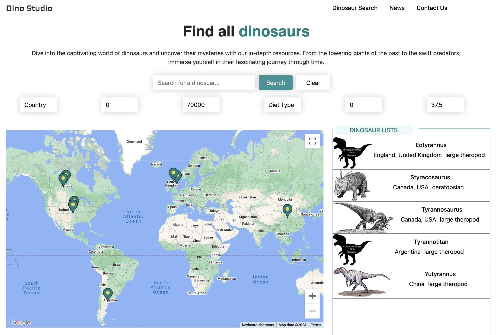
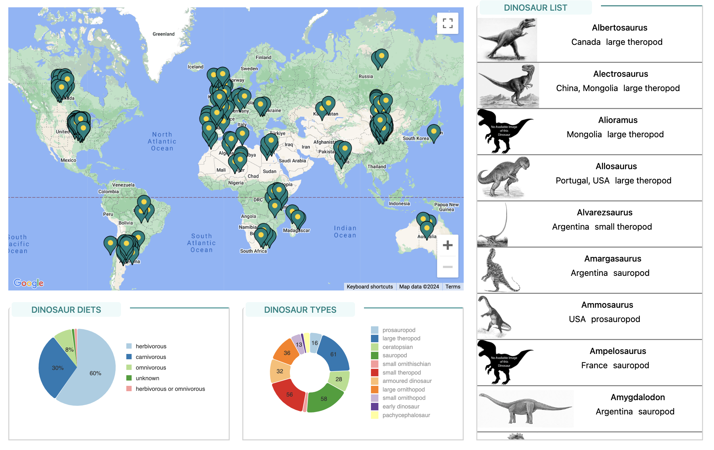
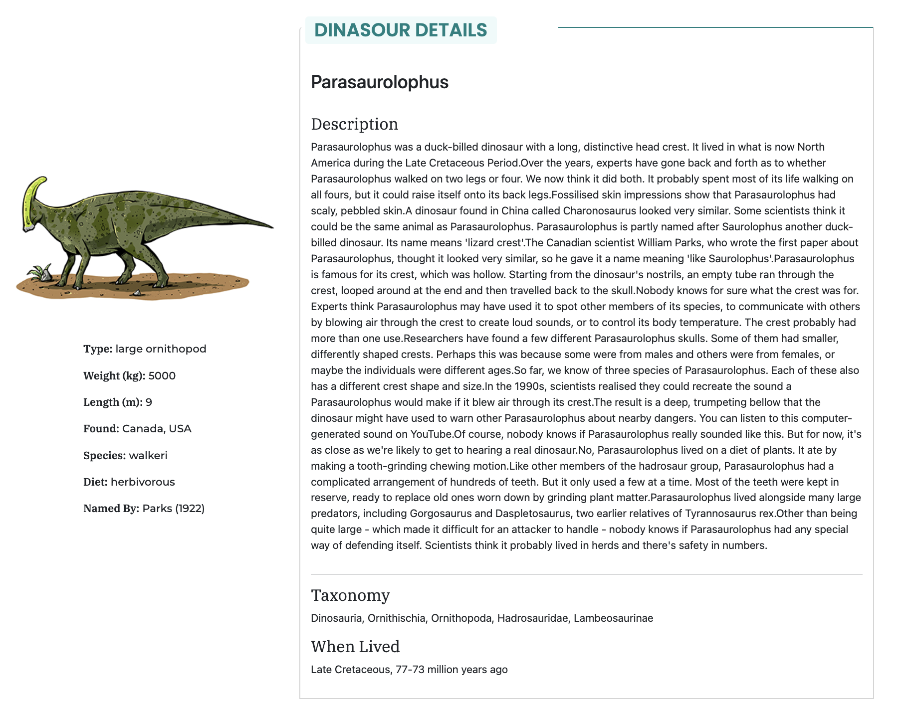
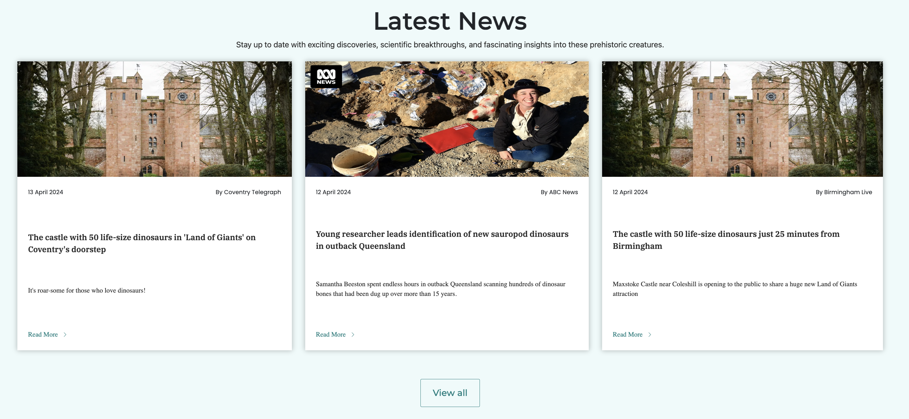
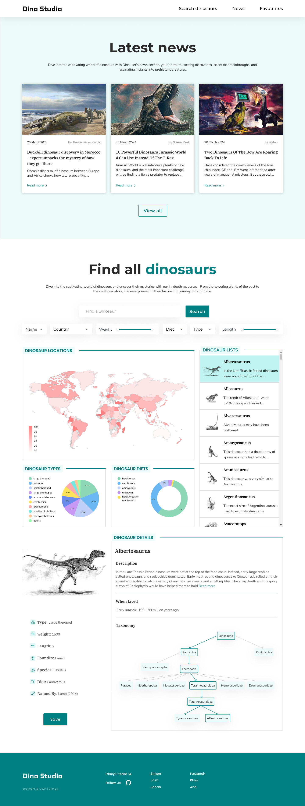

# Dino Studio

Welcome to the Dino Studio, an exciting educational app to learn all about dinosaurs! Search our list of dinos, see where in the world they were found, who named them, and read about their habitat, diet, and more. Whether you would like to dive into the latest dinosaur discoveries from around the world or uncover something new about your favorite prehistoric reptile, Dino Studio is the place to be.

## Table of Contents

- [Overview](#overview)

- [features](#features)

- [Design](#design)

- [Tech Stack](#tech-stack)

- [Tool Kit](#tool-kit)

- [Our Team](#our-team)

- [Acknowledgements](#acknowledgements)

- [About Chingu](#about-chingu)

## Overview

## Functionality

#### General:

  - A single-page application (SPA) or it's equivalent design to provide users with an immersive experience in exploring dinosaurs through a user-friendly interface.

#### Dinosaur Display

  - View dinosaurs' name, weight, length, country, diet and corresponding images sourced from the provided API data.
  - Each dinosaur entry is clickable to view full details.

#### Search

  - Search for dinosaurs by name, weight, length, country and diet.
  - Results are displayed across the app, including in the map, list, and chart components.

#### Charts Visualization

  - Two charts (pie chart and doughnut chart) illustrating the distribution of general dinosaur diet and type data.
  - Charts are visually appealing and informative, providing a clear overview of dinosaur type and diet composition.

#### Dinosaur Location Map

  - View the location of a search dinosaurs on a map.
  - Select dinosaurs from map pins to learn more.

#### Dinosaur Details View

  - View full details of a selected dinosaur upon clicking its entry.
  - Details include additional information sourced from the API data such as: name, imageSrc, typeOfDinosaur, length, diet, whenLived, typeSpecies, description, foundIn, taxonomy, namedBy

#### News

- View news about recent activity related to dinosaurs.

## Design

## Tech Stack

 &nbsp;&nbsp; &nbsp;&nbsp; &nbsp;&nbsp; &nbsp;&nbsp; &nbsp;&nbsp;

## Tool Kit

  
 &nbsp;&nbsp; &nbsp;&nbsp; &nbsp;&nbsp; &nbsp;&nbsp; &nbsp;&nbsp; &nbsp;&nbsp; &nbsp;&nbsp;

## Our Team

#### Designer:

- Farzaneh: [GitHub](https://github.com/farzaneh-falakrou) | [LinkedIn](https://www.linkedin.com/in/farzaneh-falakrou/)

#### Developers:

- Jonah: [GitHub](https://github.com/jonahunuafe)

- Josh: [GitHub](https://github.com/Joshf225) | [LinkedIn](https://www.linkedin.com/in/joshua-famose-649179247/)

- Rhys: [GitHub](https://github.com/rjmills87) | [LinkedIn](https://www.linkedin.com/in/rjmills87/)

- Simon: [GitHub](https://github.com/simonC137)

## Acknowledgements

We acknowledge the [National History Museum](https://www.nhm.ac.uk) for providing access to the dataset containing valuable information about dinosaurs. Additionally, we thank [NewsAPI](https://www.newsapi.org) for delivering the latest news on dinosaur discoveries, contributing to our ongoing exploration of this fascinating field.

We also thank [N. Style](https://thenounproject.com/creator/n.style_pic) for his dinosaur favicon design, made available--with attribution--from the [The Noun Project](https://thenounproject.com).

## About Chingu

If you aren’t yet a member of Chingu we invite you to [join us](https://www.chingu.io/). We help our
members transform what they’ve learned in courses & tutorials into the
practical experience employers need and want.
