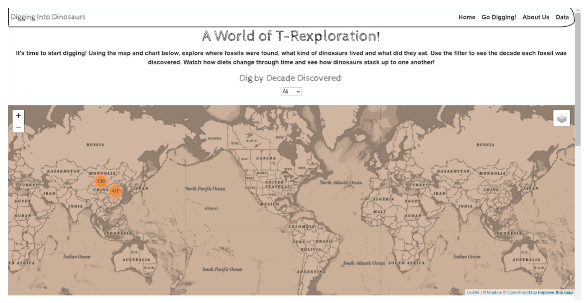
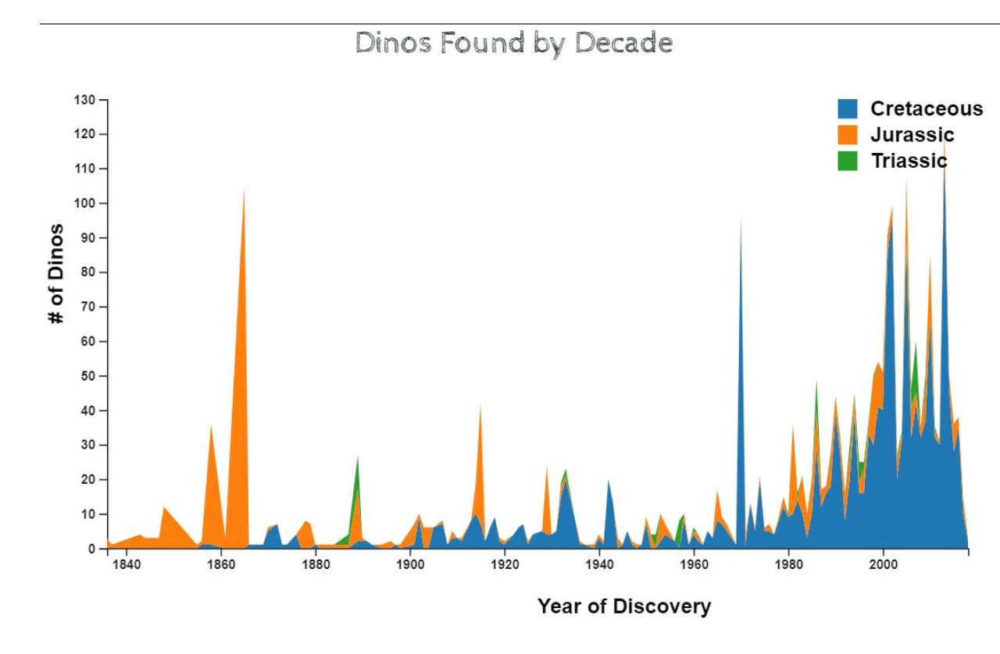
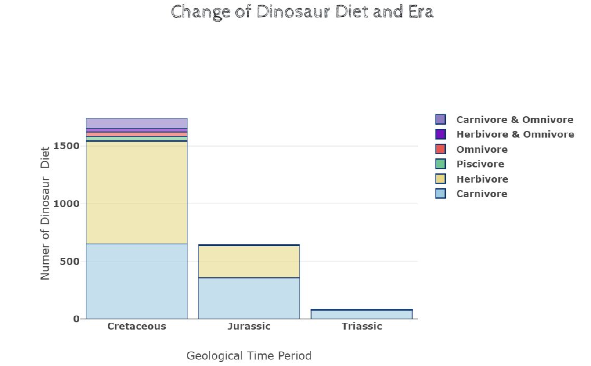

# voyage-project-tier2-dinosaurs

## Table of Contents

- [Overview](#overview)
- [General Instructions](#general-instructions)
- [Initial Setup](#initial-setup)
- [Project Workflow](#project-workflow)
- [Requirements & Specifications](#requirements-specifications)
- [Team Documents](#team-documents)
- [Tech Stack](#technology-stack)
- [Our Team](#our-team)
- [Acknowledgements](#acknowledgements)
- [About Chingu](#about-chingu)

## Overview

Hey there! How about we create an app all about dinosaurs? We've got our data all
set from the National History Museum that tells us about different dinosaurs.

Imagine our app like a dino world! We can show all kinds of dinosaurs – big ones
looking for food, calm ones eating plants, and even tiny ones running around. From
huge dinosaurs that made the ground shake to little ones in the forests.

And get this, our tool might even let us time-travel! Imagine going back in time to
see how these dinosaurs lived. Plus, it tells us what type of dinosaur it is and
where it used to call home. So, you'll get to know dinosaurs from all over the place.

We're thinking of adding a cool twist – using News data to show you the latest
discoveries about dinosaurs. Pretty cool, huh?

Let's make an app that's not just smart but also super fun for everyone!

- Dinosaur example website

- Dinosaurs example map

- Dinosaurs example charts

Your Chingu Voyage team will be using this data to create an web app that will help
anyone interested to be able to “dig” into the fossil data and discover facts
about dinosaurs in a unique way. Your app will summarize this data and will allow
users to apply a single filter to multiple visualizations simultaneously.

This will provide you with an opportunity to build Web Development experience
dealing with large volumes of dinosaurs & news data, charts, maps, and user queries.

## General Instructions

This project is designed to be worked on by a team rather than an individual
Chingu. This means you and your team will need to thoroughly read and
understand the requirements and specifications below, **_and_** define and
manage your project following the _Agile Methodology_ defined in the
[Voyage Handbook](https://github.com/chingu-voyages/Handbook/blob/main/docs/guides/voyage/voyage.md#voyage-guide).

As you create this project make sure it meets all of the requirements, but once
it reaches MVP, start implementing the optional features or get creative and
extend it in ways we haven't envisioned. In other words, use the power of
teamwork to make it distinctive and unique.

Take note that we haven't given specific direction on what your UI/UX should
look like. This is another area where you and your team can put your creativity
to work!

## Initial Setup

1. Clone the repository in the local folder of your choosing with the command  
   `git clone https://github.com/chingu-voyages/v48-tier2-team-14.git`

2. Execute npm install  
   `npm install`

3. Run the project locally  
   `npm run dev`

## Project Workflow

1. Always create a new branch for your work. Use one of the four basic types of branches (bug, feature, refactor, and style), or another type with the relevant keyword, to start with your branch's name. For example: `git checkout -b 'feature/welcome-page'`

- Ensure your branch is up to date before pushing any changes
  `git pull origin <branch name>` (branch name should be "development" depending on your situation)

2. `git init` (only required once, at the beginning of project)

3. `git add <filename>` or `git add .`(all of the files in your branch)

4. Commit to your branch using keywords: "feat, fix, style, refactor, docs" before your comment in the following format `git commit -m "keywords: <comment>"`. For example: `git commit -m "feat: Create calendar component"`

5. `git remote add origin https://github.com/chingu-voyages/v48-tier2-team-14.git` (only required once, at the beginning of project)

6. `git push origin <your branch name>`

7. Create a pull request and wait for review from a team member.

8. Once your changes have been reviewed by others, you can merge your branch with the development branch. Be sure to execute the following command to retrieve the most recent changes from the development branch: "git pull." Should conflicts arise, be sure to address them promptly and do not hesitate to ask for assistance when necessary.

## Requirements & Specifications

### What You Need to Do

The following define the minimum requirements and ideas for features you may
implement to enhance this app, if time permits.

#### Structure

- [ ] This is a purely frontend application. No backend is required.
- [ ] You may use any languages, tools, or libraries you prefer when designing and building this app.
- [ ] Utilize the provided Dinosaur's API to display data.
- [ ] You may **_NOT_** use AI-base solution generators like GitHub CoPilot.
- [ ] Useful links and resources:
  - [National History Museum](https://www.nhm.ac.uk/discover/dinosaurs.html)
  - [Dinosaurs API](https://chinguapi.onrender.com/dinosaurs)
  - [NewsAPI](https://newsapi.org/)

#### Styling

- [ ] Surprise us!!! Use your teams creativity to make this app distinctive.
- [ ] Add a footer containing a link to your teams GitHub repo
- [ ] In general, you will find these [UI design principles](https://www.justinmind.com/ui-design/principles) helpful.
- [ ] Recommend using this resource for [clean CSS](https://israelmitolu.hashnode.dev/writing-cleaner-css-using-bem-methodology)

#### Functionality

- Overview:

  - [ ] A single-page application (SPA) or it's equivalent design to provide users with an immersive experience in exploring dinosaurs through a user-friendly interface.

- Dinosaur Display

  - [ ] Display dinosaurs' name, weight, length, country, diet and corresponding images sourced from the provided API data.
  - [ ] Each dinosaur entry should be clickable to view full details.

- Search Component

  - [ ] Implement a search feature allowing users to search for dinosaurs by name, weight, length, country and diet.
  - [ ] Search results should dynamically filter and sort dinosaurs based on the entered data (name, weight, length, country, diet).

- Diet Chart Visualization

  - [ ] Display two charts (pie chart and doughnut chart) illustrating the distribution of general dinosaur diet and type data.
  - [ ] Ensure the chart is visually appealing and informative, providing a clear overview of diet composition.

- Dinosaur Location Map

  - [ ] Display the location of a selected dinosaur on a map.
  - [ ] Upon clicking a dinosaur entry, dynamically fetch and display its geographic location on an interactive map using a mapping API (e.g., Google Maps).

- Dinosaur Details View

  - [ ] Enable users to view full details of a selected dinosaur upon clicking its entry.
  - [ ] Details should include additional information sourced from the API data such as:
    - name
    - imageSrc
    - typeOfDinosaur
    - length
    - diet
    - whenLived
    - typeSpecies
    - description
    - foundIn
    - taxonomy
    - namedBy

- Responsiveness
  - [ ] Ensure the web application is responsive and accessible across various devices and screen sizes.
  - [ ] Utilize responsive design techniques to adapt to different viewport sizes.

### Extras (Not Required)

- Display news about recent dinosaur discovery
  - [ ] Consume a second API that's related to Dinosaur

## Acceptance Criteria

- Search Functionality

  - [ ] Users should be able to search for dinosaurs by name, weight, length, country and diet.
  - [ ] Search results must dynamically filter displayed dinosaurs based on the entered name, weight, length, country and diet.
  - [ ] Search functionality should be case-insensitive and allow partial matching of dinosaur names.

- Diet Chart Visualization

  - [ ] The app must display two charts (pie chart and doughnut chart) illustrating the distribution of general dinosaur diets (e.g., herbivore, carnivore, omnivore) and type based on provided data.
  - [ ] The charts must accurately represent the proportion of each diet type within the dataset.
  - [ ] Users should be able to easily interpret and interact with the chart to understand diet composition.

- Dinosaur Details View
  - [ ] Upon clicking a dinosaur entry, users must be able to view full details of the selected dinosaur.
  - [ ] Dinosaur details should include notable characteristics sourced from the API data.
  - [ ] The details view should be accessible and provide comprehensive information about the selected dinosaur.

## Team Documents

You may find these helpful as you work together to organize your project.

- [Team Project Ideas](./docs/team_project_ideas.md)
- [Team Decision Log](./docs/team_decision_log.md)

Meeting Agenda templates (located in the `/docs` directory in this repo):

- Meeting - Voyage Kickoff --> ./docs/meeting-voyage_kickoff.docx
- Meeting - App Vision & Feature Planning --> ./docs/meeting-vision_and_feature_planning.docx
- Meeting - Sprint Retrospective, Review, and Planning --> ./docs/meeting-sprint_retrospective_review_and_planning.docx
- Meeting - Sprint Open Topic Session --> ./docs/meeting-sprint_open_topic_session.docx

## Technology Stack

The core technologies used in this project:

- React
- ViteJS
- Bootstrap

## Our Team

Everyone on your team should add their name along with a link to their GitHub
& optionally their LinkedIn profiles below. Do this in Sprint #1 to validate
your repo access and to practice PR'ing with your team _before_ you start
coding!

- Teammate name #1: [GitHub](https://github.com/ghaccountname) / [LinkedIn](https://linkedin.com/in/liaccountname)
- Teammate name #2: [GitHub](https://github.com/ghaccountname) / [LinkedIn](https://linkedin.com/in/liaccountname)

  ...

- Teammate name #n: [GitHub](https://github.com/ghaccountname) / [LinkedIn](https://linkedin.com/in/liaccountname)

## Acknowledgements

We acknowledge the [National History Museum](https://www.nhm.ac.uk) for providing access to the dataset containing valuable information about dinosaurs. Additionally, we thank [NewsAPI](https://www.newsapi.org) for delivering the latest news on dinosaur discoveries, contributing to our ongoing exploration of this fascinating field.

## About Chingu

If you aren’t yet a member of Chingu we invite you to join us. We help our
members transform what they’ve learned in courses & tutorials into the
practical experience employers need and want.
